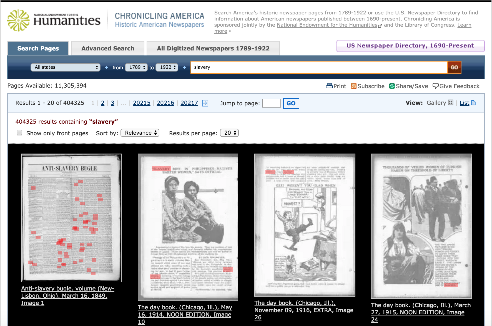

# Chapter 3: Working with APIs

[Overview of what APIs are]

Most of the APIs of interest to social scientists weren't designed for our use. They are primarily for web or mobile app developers who want to include the content on their pages. So while I might use the [MapQuest](http://developer.mapquest.com) API to look at how often intra-city trips involve highways, the target audience is business owners trying to help people get to their store. Similarly, scores of researchers have used data from [Twitter APIs](https://dev.twitter.com/docs/api/1.1) to study politics, but it was developed so that you could put a custom Twitter widget on your home page. 

The good news is that since these services want you to use their data, the APIs are often well documented, especially for languages like Python that are popular in Silicon Valley. The bad news is that APIs don't always make available the parts of the service, like historical data, that are of most interest to researchers. The worst news is research using APIs frequently violates the providers Terms of Service, so it can be an ethical grey zone. 

### A first API

When you sign up as a developer to use an API, you usually agree to only use the API to facilitate other people using the service (e.g. customer's finding their way to your store) and that you won't store the data. API providers usually enforce this through rate limiting, meaning you can only access the service so many times per minute or per day. For example, you can only search status updates 180 times every 15 minutes according to [Twitter guidelines](https://dev.twitter.com/docs/rate-limiting/1.1/limits). [Yelp](http://www.yelp.com/developers/documentation/faq) limits you to 10,000 calls per day. If you go over your limit, you won't be able to access the service for a bit. You will also get in trouble if you redistribute the data, so don't plan on doing that. One API developed specially for researcher is available ... [Chronicling America](http://chroniclingamerica.loc.gov/about/) is a joint project of the National Endowment for the Humanities and the Library of Congress that [More description.

The website has a search function and my search for the term "[slavery](http://chroniclingamerica.loc.gov/search/pages/results/?andtext=slavery)" returned 404,325 results.



This is great, but they make it much better for researchers by providing an API to assist with searching and downloading their archive. [Note about bulk downloads.]

One of the nice things about APIs is that they are often intuitive, or at least interpretable after you see them. For example, to retrieve the first page of search results into an easily digestable format, you append ``&format=json`` to the end of the search URL ``http://chroniclingamerica.loc.gov/search/pages/results/?andtext=slavery``. In your browser, this returns a text file in the JSON format.


Thankfully, the programers have made the variable names understandable. As before, the search found 404,325 results (``"totalItems": 404325,``). The server did not return all of these, however, just 20 of them (``"itemsPerPage": 20``), starting with the first result (``"startIndex": 1,``) and ending with the 20th (``"endIndex": 20,``). 


http://chroniclingamerica.loc.gov/search/pages/results/?andtext=slavery&format=json


(http://chroniclingamerica.loc.gov/about/api/)

[``requests``](http://docs.python-requests.org/en/master/) is a useful and commonly used HTTP library for python. It is not a part of the default installation, but is included with Anaconda Python Distribution. 


```python
import requests
```

It would be possible to use the API URL and parameters directly in the requests command, but since the most likely scenario involves making repeating calls to ``requests`` as part of a loop -- the search returned less than 1% of the results -- I store the strings first. 


```python
base_url = 'http://chroniclingamerica.loc.gov/search/pages/results/'
parameters = '?andtext=slavery&format=json'
```

`requests.get()` is used for both accessing websites and APIs. The command can be modified by several arguements, but at a minimum, it requires the URL.


```python
r = requests.get(base_url + parameters)
```

`r` is a `requests` response object. Any JSON returned by the server are stored in `.json().`


```python
search_json = r.json()
```

JSONs are dictionary like objects, in that they have keys (think variable names) and values. `.keys()` returns a list of the keys.


```python
print search_json.keys()
```

    [u'totalItems', u'endIndex', u'startIndex', u'itemsPerPage', u'items']


You can return the value of any key by putting the key name in brackets.


```python
search_json['totalItems']
```


    404549


As is often the case with results from an API, most of the keys and values are metadate about either the search or what is being returned. These are useful for knowing if the search is returning what you want, which is particularly important when you are making multiple calls to the API. 

The data I'm intereted in is all in `items`. 


```python
print type(search_json['items'])
print len(search_json['items'])
```

    <type 'list'>
    20


`items` is a list with 20 items.


```python
print type(search_json['items'][0])
print type(search_json['items'][19])
```

    <type 'dict'>
    <type 'dict'>


Each of the 20 items in the list is a dictionary. 


```python
first_item = search_json['items'][0]

print first_item.keys()
```

    [u'sequence', u'county', u'edition', u'frequency', u'id', u'section_label', u'city', u'date', u'title', u'end_year', u'note', u'state', u'subject', u'type', u'place_of_publication', u'start_year', u'edition_label', u'publisher', u'language', u'alt_title', u'lccn', u'country', u'ocr_eng', u'batch', u'title_normal', u'url', u'place', u'page']


While a standard CSV file has a header row that describes the contents of each column, a JSON file has keys identifying the values found in each case. Importantly, these keys need not be the same for each item. Additionally, values don't have to be numbers of strings, but could be lists or dictionaries. For example, this JSON could have included a `newspaper` key that was a dictionary with all the metadata about the newspaper the article and issue was published, an `article` key that include the article specific information as another dictionary, and a `text` key whose value was a string with the article text.

As before, we can examine the contents of a particular item, such as the publication's `title`.


```python
print first_item['title']
```

    Anti-slavery bugle. volume


The easiest way to view or analyze this data is to convert it to a dataset-like structure. While Python does not have a builting in dataframe type, the popular `pandas` library does. By convention, it is imported as `pd`.


```python
import pandas as pd

# Make sure all columns are displayed
pd.set_option("display.max_columns",101)
```

pandas is prety smart about importing different JSON-type objects and converting them to dataframes with its `.DataFrame()` function.


```python
df = pd.DataFrame(search_json['items'])

df.head(10)
```


<div>
<table border="1" class="dataframe">
  <thead>
    <tr style="text-align: right;">
      <th></th>
      <th>alt_title</th>
      <th>batch</th>
      <th>city</th>
      <th>country</th>
      <th>county</th>
      <th>date</th>
      <th>edition</th>
      <th>edition_label</th>
      <th>end_year</th>
      <th>frequency</th>
      <th>id</th>
      <th>language</th>
      <th>lccn</th>
      <th>note</th>
      <th>ocr_eng</th>
      <th>page</th>
      <th>place</th>
      <th>place_of_publication</th>
      <th>publisher</th>
      <th>section_label</th>
      <th>sequence</th>
      <th>start_year</th>
      <th>state</th>
      <th>subject</th>
      <th>title</th>
      <th>title_normal</th>
      <th>type</th>
      <th>url</th>
    </tr>
  </thead>
  <tbody>
    <tr>
      <th>0</th>
      <td>[]</td>
      <td>batch_ohi_ariel_ver02</td>
      <td>[New Lisbon, Salem]</td>
      <td>Ohio</td>
      <td>[Columbiana, Columbiana]</td>
      <td>18490316</td>
      <td>None</td>
      <td></td>
      <td>1861</td>
      <td>Weekly</td>
      <td>/lccn/sn83035487/1849-03-16/ed-1/seq-1/</td>
      <td>[English]</td>
      <td>sn83035487</td>
      <td>[Archived issues are available in digital form...</td>
      <td>LAVE\nam\nJlile\nVOL. 4. NO. 30.\nSALEM. OHIO,...</td>
      <td></td>
      <td>[Ohio--Columbiana--New Lisbon, Ohio--Columbian...</td>
      <td>New-Lisbon, Ohio</td>
      <td>Ohio American Antislavery Society</td>
      <td></td>
      <td>1</td>
      <td>1845</td>
      <td>[Ohio, Ohio]</td>
      <td>[Antislavery movements--United States--Newspap...</td>
      <td>Anti-slavery bugle. volume</td>
      <td>anti-slavery bugle.</td>
      <td>page</td>
      <td>http://chroniclingamerica.loc.gov/lccn/sn83035...</td>
    </tr>
    <tr>
      <th>1</th>
      <td>[]</td>
      <td>batch_iune_golf_ver01</td>
      <td>[Chicago]</td>
      <td>Illinois</td>
      <td>[Cook County]</td>
      <td>19140516</td>
      <td>None</td>
      <td>NOON EDITION</td>
      <td>1917</td>
      <td>Daily (except Sunday and holidays)</td>
      <td>/lccn/sn83045487/1914-05-16/ed-1/seq-10/</td>
      <td>[English]</td>
      <td>sn83045487</td>
      <td>["An adless daily newspaper.", Archived issues...</td>
      <td>r\nmmmmmmmmmmmmmmmmmmmmmmmm\n'SLAVERY RIFE IN ...</td>
      <td></td>
      <td>[Illinois--Cook County--Chicago]</td>
      <td>Chicago, Ill.</td>
      <td>N.D. Cochran</td>
      <td></td>
      <td>10</td>
      <td>1911</td>
      <td>[Illinois]</td>
      <td>[Chicago (Ill.)--Newspapers., Illinois--Chicag...</td>
      <td>The day book.</td>
      <td>day book.</td>
      <td>page</td>
      <td>http://chroniclingamerica.loc.gov/lccn/sn83045...</td>
    </tr>
    <tr>
      <th>2</th>
      <td>[]</td>
      <td>batch_iune_india_ver01</td>
      <td>[Chicago]</td>
      <td>Illinois</td>
      <td>[Cook County]</td>
      <td>19161109</td>
      <td>None</td>
      <td>EXTRA</td>
      <td>1917</td>
      <td>Daily (except Sunday and holidays)</td>
      <td>/lccn/sn83045487/1916-11-09/ed-1/seq-26/</td>
      <td>[English]</td>
      <td>sn83045487</td>
      <td>["An adless daily newspaper.", Archived issues...</td>
      <td>us remaining whites if we expect to\nstay on t...</td>
      <td></td>
      <td>[Illinois--Cook County--Chicago]</td>
      <td>Chicago, Ill.</td>
      <td>N.D. Cochran</td>
      <td></td>
      <td>26</td>
      <td>1911</td>
      <td>[Illinois]</td>
      <td>[Chicago (Ill.)--Newspapers., Illinois--Chicag...</td>
      <td>The day book.</td>
      <td>day book.</td>
      <td>page</td>
      <td>http://chroniclingamerica.loc.gov/lccn/sn83045...</td>
    </tr>
    <tr>
      <th>3</th>
      <td>[]</td>
      <td>batch_iune_golf_ver01</td>
      <td>[Chicago]</td>
      <td>Illinois</td>
      <td>[Cook County]</td>
      <td>19150327</td>
      <td>None</td>
      <td>NOON EDITION</td>
      <td>1917</td>
      <td>Daily (except Sunday and holidays)</td>
      <td>/lccn/sn83045487/1915-03-27/ed-1/seq-24/</td>
      <td>[English]</td>
      <td>sn83045487</td>
      <td>["An adless daily newspaper.", Archived issues...</td>
      <td>THOUSANDS OF VEILED WOMEN OF TURKISH\nHAREM ON...</td>
      <td></td>
      <td>[Illinois--Cook County--Chicago]</td>
      <td>Chicago, Ill.</td>
      <td>N.D. Cochran</td>
      <td></td>
      <td>24</td>
      <td>1911</td>
      <td>[Illinois]</td>
      <td>[Chicago (Ill.)--Newspapers., Illinois--Chicag...</td>
      <td>The day book.</td>
      <td>day book.</td>
      <td>page</td>
      <td>http://chroniclingamerica.loc.gov/lccn/sn83045...</td>
    </tr>
    <tr>
      <th>4</th>
      <td>[]</td>
      <td>batch_iune_foxtrot_ver01</td>
      <td>[Chicago]</td>
      <td>Illinois</td>
      <td>[Cook County]</td>
      <td>19130815</td>
      <td>None</td>
      <td></td>
      <td>1917</td>
      <td>Daily (except Sunday and holidays)</td>
      <td>/lccn/sn83045487/1913-08-15/ed-1/seq-5/</td>
      <td>[English]</td>
      <td>sn83045487</td>
      <td>["An adless daily newspaper.", Archived issues...</td>
      <td>LOLA NORRiajQlVS SiENSAT-iPN AL t EVIDENCE IN ...</td>
      <td></td>
      <td>[Illinois--Cook County--Chicago]</td>
      <td>Chicago, Ill.</td>
      <td>N.D. Cochran</td>
      <td></td>
      <td>5</td>
      <td>1911</td>
      <td>[Illinois]</td>
      <td>[Chicago (Ill.)--Newspapers., Illinois--Chicag...</td>
      <td>The day book.</td>
      <td>day book.</td>
      <td>page</td>
      <td>http://chroniclingamerica.loc.gov/lccn/sn83045...</td>
    </tr>
    <tr>
      <th>5</th>
      <td>[]</td>
      <td>batch_iune_foxtrot_ver01</td>
      <td>[Chicago]</td>
      <td>Illinois</td>
      <td>[Cook County]</td>
      <td>19130308</td>
      <td>None</td>
      <td>NOON EDITION</td>
      <td>1917</td>
      <td>Daily (except Sunday and holidays)</td>
      <td>/lccn/sn83045487/1913-03-08/ed-1/seq-6/</td>
      <td>[English]</td>
      <td>sn83045487</td>
      <td>["An adless daily newspaper.", Archived issues...</td>
      <td>that every possible weakness in. a\ngirl as &amp;e...</td>
      <td></td>
      <td>[Illinois--Cook County--Chicago]</td>
      <td>Chicago, Ill.</td>
      <td>N.D. Cochran</td>
      <td></td>
      <td>6</td>
      <td>1911</td>
      <td>[Illinois]</td>
      <td>[Chicago (Ill.)--Newspapers., Illinois--Chicag...</td>
      <td>The day book.</td>
      <td>day book.</td>
      <td>page</td>
      <td>http://chroniclingamerica.loc.gov/lccn/sn83045...</td>
    </tr>
    <tr>
      <th>6</th>
      <td>[]</td>
      <td>batch_iune_foxtrot_ver01</td>
      <td>[Chicago]</td>
      <td>Illinois</td>
      <td>[Cook County]</td>
      <td>19130424</td>
      <td>None</td>
      <td></td>
      <td>1917</td>
      <td>Daily (except Sunday and holidays)</td>
      <td>/lccn/sn83045487/1913-04-24/ed-1/seq-13/</td>
      <td>[English]</td>
      <td>sn83045487</td>
      <td>["An adless daily newspaper.", Archived issues...</td>
      <td>mpICFED FOR WHITE -SLAVERY.\nTop Lola Norris-a...</td>
      <td></td>
      <td>[Illinois--Cook County--Chicago]</td>
      <td>Chicago, Ill.</td>
      <td>N.D. Cochran</td>
      <td></td>
      <td>13</td>
      <td>1911</td>
      <td>[Illinois]</td>
      <td>[Chicago (Ill.)--Newspapers., Illinois--Chicag...</td>
      <td>The day book.</td>
      <td>day book.</td>
      <td>page</td>
      <td>http://chroniclingamerica.loc.gov/lccn/sn83045...</td>
    </tr>
    <tr>
      <th>7</th>
      <td>[]</td>
      <td>batch_dlc_elf_ver03</td>
      <td>[Washington]</td>
      <td>District of Columbia</td>
      <td>[None]</td>
      <td>18540511</td>
      <td>None</td>
      <td></td>
      <td>1860</td>
      <td>Weekly</td>
      <td>/lccn/sn84026752/1854-05-11/ed-1/seq-1/</td>
      <td>[English]</td>
      <td>sn84026752</td>
      <td>[Also issued on microfilm by University Microf...</td>
      <td>I IiiLMI or SUBSCRimOM\nI T. \ .. &amp;m is publis...</td>
      <td></td>
      <td>[District of Columbia--Washington]</td>
      <td>Washington [D.C.]</td>
      <td>L.P. Noble</td>
      <td></td>
      <td>1</td>
      <td>1847</td>
      <td>[District of Columbia]</td>
      <td>[African Americans--Washington (D.C.)--Newspap...</td>
      <td>The national era.</td>
      <td>national era.</td>
      <td>page</td>
      <td>http://chroniclingamerica.loc.gov/lccn/sn84026...</td>
    </tr>
    <tr>
      <th>8</th>
      <td>[]</td>
      <td>batch_iune_foxtrot_ver01</td>
      <td>[Chicago]</td>
      <td>Illinois</td>
      <td>[Cook County]</td>
      <td>19130225</td>
      <td>None</td>
      <td></td>
      <td>1917</td>
      <td>Daily (except Sunday and holidays)</td>
      <td>/lccn/sn83045487/1913-02-25/ed-1/seq-30/</td>
      <td>[English]</td>
      <td>sn83045487</td>
      <td>["An adless daily newspaper.", Archived issues...</td>
      <td>we are doing what the American\nmen did Avay b...</td>
      <td></td>
      <td>[Illinois--Cook County--Chicago]</td>
      <td>Chicago, Ill.</td>
      <td>N.D. Cochran</td>
      <td></td>
      <td>30</td>
      <td>1911</td>
      <td>[Illinois]</td>
      <td>[Chicago (Ill.)--Newspapers., Illinois--Chicag...</td>
      <td>The day book.</td>
      <td>day book.</td>
      <td>page</td>
      <td>http://chroniclingamerica.loc.gov/lccn/sn83045...</td>
    </tr>
    <tr>
      <th>9</th>
      <td>[]</td>
      <td>batch_dlc_elf_ver03</td>
      <td>[Washington]</td>
      <td>District of Columbia</td>
      <td>[None]</td>
      <td>18540511</td>
      <td>None</td>
      <td></td>
      <td>1860</td>
      <td>Weekly</td>
      <td>/lccn/sn84026752/1854-05-11/ed-1/seq-4/</td>
      <td>[English]</td>
      <td>sn84026752</td>
      <td>[Also issued on microfilm by University Microf...</td>
      <td>f\nI 76\n[COXTIHCED PBOM KIMT PAGE.]\nour fath...</td>
      <td>76</td>
      <td>[District of Columbia--Washington]</td>
      <td>Washington [D.C.]</td>
      <td>L.P. Noble</td>
      <td></td>
      <td>4</td>
      <td>1847</td>
      <td>[District of Columbia]</td>
      <td>[African Americans--Washington (D.C.)--Newspap...</td>
      <td>The national era.</td>
      <td>national era.</td>
      <td>page</td>
      <td>http://chroniclingamerica.loc.gov/lccn/sn84026...</td>
    </tr>
  </tbody>
</table>
</div>


Note that I converted `search_json['items']` to  dataframe and not the entire JSON file. This is because I wanted each row to be an article. 

If this dataframe contained all the items that you were looking for, it would be easy to save this to a csv file for storage and later analysis.


```python
df.to_csv('lynching_articles.csv')
```

This is only a small subset of the articles on lynching that are available, however. The API returns results in batches of 20 and this is only the first page of results. As is often the case, I'll need to make multiple calls to the API to retrieve all the data of interest. The easiest way to do that is to define a small function for getting the article information and put that in a loop. While it isn't a requirement that you create a function for making the API call, it will make your code easier to read and debug.


Looking at the API guidelines, there is an additional paramater `page` that tells the API which subset of results we want. This name varies by API but their is usually some mechanism for retrieiving results beyond the initial JSON.

Before creating the loop and making multiple calls to the API, I want to make sure that the API is working the way I think it is. 


```python
base_url = 'http://chroniclingamerica.loc.gov/search/pages/results/'
parameters = '?andtext=slavery&format=json&page=3'
r = requests.get(base_url + parameters)
results =  r.json()

print results['startIndex']
print results['endIndex']
```

    41
    60


A call to random selected page 3 returns results 41 through 60, which is what I expected since each page has 20 items.

The parameters are getting pretty ugly, so fortunately `requests` accepts a dictionary where the keys are the parameter names as defined by the API and the values are the search paramaters you are looking for. So the same request can be rewritten:


```python
base_url = 'http://chroniclingamerica.loc.gov/search/pages/results/'
parameters = {'andtext': 'lynching',
              'page' : 3,
              'format'  : 'json'}
r = requests.get(base_url, params=parameters)

results =  r.json()

print results['startIndex']
print results['endIndex']
```

    41
    60


This can be rewritten as function:


```python
def get_articles():
    '''
    Make calls to the Chronicling America API.
    '''
    base_url = 'http://chroniclingamerica.loc.gov/search/pages/results/'
    parameters = {'andtext': 'lynching',
                  'page' : 3,
              'format'  : 'json'}
    r = requests.get(base_url, params=parameters)
    results =  r.json()
    return results
```


```python
results = get_articles()

print results['startIndex']
print results['endIndex']
```

    41
    60


The advantage of writing a function, however, would be that you can pass along your own parameters, such as the search term and page number, which would make this much more useful. 


```python
def get_articles(search_term, page_number):
    '''
    Make calls to the Chronicling America API.
    '''
    base_url = 'http://chroniclingamerica.loc.gov/search/pages/results/'
    parameters = {'andtext': search_term,
                  'page' : page_number,
              'format'  : 'json'}
    r = requests.get(base_url, params=parameters)
    results =  r.json()
    return results
```


```python
results = get_articles('lynching', 3)

print results['startIndex']
print results['endIndex']
```

    41
    60


Now, the first 60 results could downloaded in a just a few lines:


```python
for page_number in range(1,4): # range stops before it gets to the last number
    results = get_articles('lynching', page_number)
    print results['startIndex'], results['endIndex']
    
```

    1 20
    21 40
    41 60


Everything appears to be working, but unfortunately I only have the last page of results still. Each call to the API was redefining `results` variable. In this case, I set up an empty dataframe to store the results and will append the items from each page of results.


```python
df = pd.DataFrame()

for page_number in range(1,4):
    results = get_articles('lynching', page_number)
    new_df = pd.DataFrame(results['items'])
    df = df.append(new_df , ignore_index=True)
    
print len(df)
df.head(5)
```

    60


<div>
<table border="1" class="dataframe">
  <thead>
    <tr style="text-align: right;">
      <th></th>
      <th>alt_title</th>
      <th>batch</th>
      <th>city</th>
      <th>country</th>
      <th>county</th>
      <th>date</th>
      <th>edition</th>
      <th>edition_label</th>
      <th>end_year</th>
      <th>frequency</th>
      <th>id</th>
      <th>language</th>
      <th>lccn</th>
      <th>note</th>
      <th>ocr_eng</th>
      <th>page</th>
      <th>place</th>
      <th>place_of_publication</th>
      <th>publisher</th>
      <th>section_label</th>
      <th>sequence</th>
      <th>start_year</th>
      <th>state</th>
      <th>subject</th>
      <th>title</th>
      <th>title_normal</th>
      <th>type</th>
      <th>url</th>
    </tr>
  </thead>
  <tbody>
    <tr>
      <th>0</th>
      <td>[]</td>
      <td>batch_mimtptc_jackson_ver01</td>
      <td>[Dearborn]</td>
      <td>Michigan</td>
      <td>[Wayne]</td>
      <td>19211022</td>
      <td>None</td>
      <td></td>
      <td>1927</td>
      <td>Weekly</td>
      <td>/lccn/2013218776/1921-10-22/ed-1/seq-1/</td>
      <td>[English]</td>
      <td>2013218776</td>
      <td>["The Ford international weekly" appears with ...</td>
      <td>"Mis-Picturing Us Abroad" Introduces the Serie...</td>
      <td></td>
      <td>[Michigan--Wayne--Dearborn]</td>
      <td>Dearborn, Mich.</td>
      <td>Suburban Pub. Co.</td>
      <td></td>
      <td>1</td>
      <td>1901</td>
      <td>[Michigan]</td>
      <td>[Dearborn (Mich.)--Newspapers., Michigan--Dear...</td>
      <td>Dearborn independent.</td>
      <td>dearborn independent.</td>
      <td>page</td>
      <td>http://chroniclingamerica.loc.gov/lccn/2013218...</td>
    </tr>
    <tr>
      <th>1</th>
      <td>[]</td>
      <td>batch_iune_hotel_ver01</td>
      <td>[Chicago]</td>
      <td>Illinois</td>
      <td>[Cook County]</td>
      <td>19150818</td>
      <td>None</td>
      <td>LAST EDITION</td>
      <td>1917</td>
      <td>Daily (except Sunday and holidays)</td>
      <td>/lccn/sn83045487/1915-08-18/ed-1/seq-4/</td>
      <td>[English]</td>
      <td>sn83045487</td>
      <td>["An adless daily newspaper.", Archived issues...</td>
      <td>25 patriots who took into their own\nhands a l...</td>
      <td></td>
      <td>[Illinois--Cook County--Chicago]</td>
      <td>Chicago, Ill.</td>
      <td>N.D. Cochran</td>
      <td></td>
      <td>4</td>
      <td>1911</td>
      <td>[Illinois]</td>
      <td>[Chicago (Ill.)--Newspapers., Illinois--Chicag...</td>
      <td>The day book.</td>
      <td>day book.</td>
      <td>page</td>
      <td>http://chroniclingamerica.loc.gov/lccn/sn83045...</td>
    </tr>
    <tr>
      <th>2</th>
      <td>[Star, Sunday star]</td>
      <td>batch_dlc_dalek_ver01</td>
      <td>[Washington]</td>
      <td>District of Columbia</td>
      <td>[None]</td>
      <td>19221123</td>
      <td>None</td>
      <td></td>
      <td>1972</td>
      <td>Daily</td>
      <td>/lccn/sn83045462/1922-11-23/ed-1/seq-34/</td>
      <td>[English]</td>
      <td>sn83045462</td>
      <td>["From April 25 through May 24, 1861 one sheet...</td>
      <td>T\nTU^\nnit;\n- V E\nxl\nII\nb&lt;\nin rour\n3436...</td>
      <td>34</td>
      <td>[District of Columbia--Washington]</td>
      <td>Washington, D.C.</td>
      <td>W.D. Wallach &amp; Hope</td>
      <td></td>
      <td>34</td>
      <td>1854</td>
      <td>[District of Columbia]</td>
      <td>[Washington (D.C.)--fast--(OCoLC)fst01204505, ...</td>
      <td>Evening star.</td>
      <td>evening star.</td>
      <td>page</td>
      <td>http://chroniclingamerica.loc.gov/lccn/sn83045...</td>
    </tr>
    <tr>
      <th>3</th>
      <td>[]</td>
      <td>batch_wa_elm_ver01</td>
      <td>[Seattle]</td>
      <td>Washington</td>
      <td>[King]</td>
      <td>19180608</td>
      <td>None</td>
      <td></td>
      <td>1921</td>
      <td>Weekly</td>
      <td>/lccn/sn87093353/1918-06-08/ed-1/seq-4/</td>
      <td>[English]</td>
      <td>sn87093353</td>
      <td>["A publication of general information, but in...</td>
      <td>DAMNABLE WHITE WHELPS\nSome of the white subsc...</td>
      <td></td>
      <td>[Washington--King--Seattle]</td>
      <td>Seattle, Wash.</td>
      <td>H.R. Cayton</td>
      <td></td>
      <td>4</td>
      <td>1916</td>
      <td>[Washington]</td>
      <td>[African Americans--Washington (State)--Seattl...</td>
      <td>Cayton's weekly.</td>
      <td>cayton's weekly.</td>
      <td>page</td>
      <td>http://chroniclingamerica.loc.gov/lccn/sn87093...</td>
    </tr>
    <tr>
      <th>4</th>
      <td>[]</td>
      <td>batch_iune_delta_ver01</td>
      <td>[Chicago]</td>
      <td>Illinois</td>
      <td>[Cook County]</td>
      <td>19130507</td>
      <td>None</td>
      <td></td>
      <td>1917</td>
      <td>Daily (except Sunday and holidays)</td>
      <td>/lccn/sn83045487/1913-05-07/ed-1/seq-12/</td>
      <td>[English]</td>
      <td>sn83045487</td>
      <td>["An adless daily newspaper.", Archived issues...</td>
      <td>TEN COMPANIES OF MILITIA PROTECT ..THE\nALLEGE...</td>
      <td></td>
      <td>[Illinois--Cook County--Chicago]</td>
      <td>Chicago, Ill.</td>
      <td>N.D. Cochran</td>
      <td></td>
      <td>12</td>
      <td>1911</td>
      <td>[Illinois]</td>
      <td>[Chicago (Ill.)--Newspapers., Illinois--Chicag...</td>
      <td>The day book.</td>
      <td>day book.</td>
      <td>page</td>
      <td>http://chroniclingamerica.loc.gov/lccn/sn83045...</td>
    </tr>
  </tbody>
</table>
</div>


For a large download, you would still want to tweak this a bit by pausing between each API call and making it robust to internet or API errors, but this is a solid framework for collecting data from an API.

### A second API

While the Chronicling America API allows annonymous usage, most APIs require you to register in advance. This usually involves going to their website, signing up for the service, and then going through a second signup for developers.  
When you sign up  to use an API, you usually agree to only use the API to facilitate other people using the service (e.g. customer's finding their way to your store) and that you won't store the data. API providers usually enforce this through rate limiting, meaning you can only access the service so many times per minute or per day. For example, you can only search status updates 180 times every 15 minutes according to [Twitter guidelines](https://dev.twitter.com/docs/rate-limiting/1.1/limits). [Yelp](http://www.yelp.com/developers/documentation/faq) limits you to 10,000 calls per day. If you go over your limit, you won't be able to access the service for a bit. You will also get in trouble if you redistribute the data, so don't plan on doing that. 

Two of the major reasons that web services require API authentication is so that they know who you are and so they can make sure that you don't go over their rate limits. Since you shouldn't be giving your password to random people on the internet, API authentication works a little bit differently. Like many other places, in order to use the Yelp API you have to sign up as [developer](http://www.yelp.com/developers). After telling them a little bit about what you plan to do--feel free to be honest; they aren't going to deny you access if you put "research on food cultures" as the purpose--you will get a Consumer Key, Consumer Secret, Token, and Token Secret. Copy and paste them somewhere special. 

Using the Yelp API goes something like this. First, you tell Yelp who you are and what you want. Assuming you are authorized to have this information, they respond with a URL where you can retrieve the data. The coding for this in practice is a little bit complicated, so there are often single use tools for accessing APIs, like [Tweepy](http://tweepy.github.io) for Twitter. 

Yelp uses the OAuth protocol for authentication. There are several python libraries for handling this, but you will likely need to install one (via `conda` or `pip`) yourself first.


```python
import oauth2
```


There's no module to install for the Yelp API, but Yelp does provide some [sample Python code](https://github.com/Yelp/yelp-api/tree/master/v2/python). I've slightly modified the code below to show a sample search for restaurants near Chapel Hill, NC, sorted by distance. You can find more options in the search [documentation](http://www.yelp.com/developers/documentation/v2/search_api). The API's search options include things like location and type of business, and allows you to sort either by distance or popularity.


```python
consumer_key    = 'qDBPo9c_szHVrZwxzo-zDw'
consumer_secret = '4we8Jz9rq5J3j15Z5yCUqmgDJjM'
token           = 'jeRrhRey_k-emvC_VFLGrlVHrkR4P3UF'
token_secret    = 'n-7xHNCxxedmAMYZPQtnh1hd7lI'

consumer = oauth2.Consumer(consumer_key, consumer_secret)

category_filter = 'restaurants'
location = 'Chapel Hill, NC'
options =  'category_filter=%s&location=%s&sort=1' % (category_filter, location)
url = 'http://api.yelp.com/v2/search?' + options

oauth_request = oauth2.Request('GET', url, {})
oauth_request.update({'oauth_nonce'      : oauth2.generate_nonce(),
                      'oauth_timestamp'  : oauth2.generate_timestamp(),
                      'oauth_token'       : token,
                      'oauth_consumer_key': consumer_key})

token = oauth2.Token(token, token_secret)
oauth_request.sign_request(oauth2.SignatureMethod_HMAC_SHA1(), consumer, token)
signed_url = oauth_request.to_url()

print signed_url
```

    http://api.yelp.com/v2/search?sort=1&oauth_body_hash=2jmj7l5rSw0yVb%2FvlWAYkK%2FYBwk%3D&oauth_nonce=35980538&oauth_timestamp=1475698040&oauth_consumer_key=qDBPo9c_szHVrZwxzo-zDw&oauth_signature_method=HMAC-SHA1&category_filter=restaurants&oauth_token=jeRrhRey_k-emvC_VFLGrlVHrkR4P3UF&location=Chapel+Hill%2C+NC&oauth_signature=FVpomqjb96J3rG2Eb5bLmzaCSrs%3D


The URL returned expires after a couple of seconds, so don't expect for the above link to work. The results are provided in the JSON file format, so I'm going to use the already imported `requests` module to download them.


```python
resp = requests.get(url=signed_url)
chapel_hill_restaurants = resp.json()

print chapel_hill_restaurants.keys()
```

    [u'region', u'total', u'businesses']


As with the Chronacling America API, the top level of the JSON contains some metadata about the search with all the specific items in one field. In this case, `businesses`.


```python
chapel_hill_restaurants['businesses'][1]
```


    {u'categories': [[u'Burgers', u'burgers'], [u'Hot Dogs', u'hotdog']],
     u'display_phone': u'+1-919-240-4746',
     u'id': u'buns-chapel-hill',
     u'image_url': u'https://s3-media1.fl.yelpcdn.com/bphoto/5VCBOVZXf0y5TmIVTTuD1w/ms.jpg',
     u'is_claimed': True,
     u'is_closed': False,
     u'location': {u'address': [u'107 N Columbia St'],
      u'city': u'Chapel Hill',
      u'coordinate': {u'latitude': 35.913498068127,
       u'longitude': -79.056107631617},
      u'country_code': u'US',
      u'display_address': [u'107 N Columbia St', u'Chapel Hill, NC 27514'],
      u'geo_accuracy': 9.5,
      u'postal_code': u'27514',
      u'state_code': u'NC'},
     u'mobile_url': u'https://m.yelp.com/biz/buns-chapel-hill?adjust_creative=qDBPo9c_szHVrZwxzo-zDw&utm_campaign=yelp_api&utm_medium=api_v2_search&utm_source=qDBPo9c_szHVrZwxzo-zDw',
     u'name': u'Buns',
     u'phone': u'9192404746',
     u'rating': 4.0,
     u'rating_img_url': u'https://s3-media4.fl.yelpcdn.com/assets/2/www/img/c2f3dd9799a5/ico/stars/v1/stars_4.png',
     u'rating_img_url_large': u'https://s3-media2.fl.yelpcdn.com/assets/2/www/img/ccf2b76faa2c/ico/stars/v1/stars_large_4.png',
     u'rating_img_url_small': u'https://s3-media4.fl.yelpcdn.com/assets/2/www/img/f62a5be2f902/ico/stars/v1/stars_small_4.png',
     u'review_count': 280,
     u'snippet_image_url': u'https://s3-media1.fl.yelpcdn.com/photo/HHBYKIwnQh8afZUBydhpIQ/ms.jpg',
     u'snippet_text': u"I can't get enough of their Goat Cheese burger. Add caramelozed onions and tomato and you have THE most mouth watering burger. Seriously. \n\nOn Tuesdays you...",
     u'url': u'https://www.yelp.com/biz/buns-chapel-hill?adjust_creative=qDBPo9c_szHVrZwxzo-zDw&utm_campaign=yelp_api&utm_medium=api_v2_search&utm_source=qDBPo9c_szHVrZwxzo-zDw'}


Inspecting the returned results for one restaraunt, it is clear that Yelp is keeping a lot of the review data for themselves. They returned the overall restaurant `rating`, but they provide only a small bit of text (`snippet_text`) instead of the full reviews and ratings. 


```python
print chapel_hill_restaurants['total']
print len(chapel_hill_restaurants['businesses'])
```

    40
    20


Additionally, they cap the total number of business the search will return at 40 and only provide 20 results for each API call.

Even with these restrictions, it still might be useful for social science research. As before, you would likely want to define a function in order to make repeated calls to the API. In this, the easier solution might be to create two functions. One that gets a single page and another which retrieves both pages for a single geographical area by calling the first function twice. While it would be possible to do this with zero or one new functions, creating two functions allows for better control over finding and debugging errors since you can test each function independently. Creating lots of small functions generally the code more readable, especially in case like this where you are looping over pages within restaurants within geographic areas. In general, I think the principle of a workflow consisting of small functions, as is commonly found in Python code, is something that social scientists should adopt even when they aren't writing Python.


```python
def get_yelp_page(location, offset):
    '''
    Retrieve one page of results from the Yelp API
    Returns a JSON file
    '''
    # from https://github.com/Yelp/yelp-api/tree/master/v2/python
    consumer_key    = 'qDBPo9c_szHVrZwxzo-zDw'
    consumer_secret = '4we8Jz9rq5J3j15Z5yCUqmgDJjM'
    token           = 'jeRrhRey_k-emvC_VFLGrlVHrkR4P3UF'
    token_secret    = 'n-7xHNCxxedmAMYZPQtnh1hd7lI'
    
    consumer = oauth2.Consumer(consumer_key, consumer_secret)
    
    url = 'http://api.yelp.com/v2/search?category_filter=restaurants&location=%s&sort=1&offset=%s' % (location, offset)
    
    oauth_request = oauth2.Request('GET', url, {})
    oauth_request.update({'oauth_nonce': oauth2.generate_nonce(),
                          'oauth_timestamp': oauth2.generate_timestamp(),
                          'oauth_token': token,
                          'oauth_consumer_key': consumer_key})
    
    token = oauth2.Token(token, token_secret)
    
    oauth_request.sign_request(oauth2.SignatureMethod_HMAC_SHA1(), consumer, token)
    
    signed_url = oauth_request.to_url()
    resp = requests.get(url=signed_url)
    return resp.json()

def get_yelp_results(location):
    '''
    Retrive both pages of results from the Yelp API
    Returns a dataframe
    '''
    df = pd.DataFrame()
    for offset in [1,21]:
        results = get_yelp_page(location, offset)
        new_df = pd.DataFrame(results['businesses'])
        df = df.append(new_df , ignore_index=True)
    return df
```


```python
ch_df = get_yelp_results('Chapel Hill, NC')

print len(ch_df)
```

    39


```python
ch_df.keys()
```


    Index([u'categories', u'display_phone', u'id', u'image_url', u'is_claimed',
           u'is_closed', u'location', u'menu_date_updated', u'menu_provider',
           u'mobile_url', u'name', u'phone', u'rating', u'rating_img_url',
           u'rating_img_url_large', u'rating_img_url_small', u'review_count',
           u'snippet_image_url', u'snippet_text', u'url'],
          dtype='object')


```python
ch_df[['name','categories','review_count','rating']].sort_values(by='rating', ascending=False)
```


<div>
<table border="1" class="dataframe">
  <thead>
    <tr style="text-align: right;">
      <th></th>
      <th>name</th>
      <th>categories</th>
      <th>review_count</th>
      <th>rating</th>
    </tr>
  </thead>
  <tbody>
    <tr>
      <th>5</th>
      <td>Khushi Salads &amp; Wraps</td>
      <td>[[Salad, salad], [Indian, indpak], [Vegan, veg...</td>
      <td>16</td>
      <td>5.0</td>
    </tr>
    <tr>
      <th>38</th>
      <td>Tarantini</td>
      <td>[[Italian, italian]]</td>
      <td>67</td>
      <td>4.5</td>
    </tr>
    <tr>
      <th>8</th>
      <td>Imbibe</td>
      <td>[[American (New), newamerican], [Wine Bars, wi...</td>
      <td>15</td>
      <td>4.5</td>
    </tr>
    <tr>
      <th>18</th>
      <td>Al's Burger Shack</td>
      <td>[[Burgers, burgers]]</td>
      <td>257</td>
      <td>4.5</td>
    </tr>
    <tr>
      <th>23</th>
      <td>Merritt's Store &amp; Grill</td>
      <td>[[Sandwiches, sandwiches], [Convenience Stores...</td>
      <td>219</td>
      <td>4.5</td>
    </tr>
    <tr>
      <th>24</th>
      <td>Sunrise Biscuit Kitchen</td>
      <td>[[Breakfast &amp; Brunch, breakfast_brunch]]</td>
      <td>445</td>
      <td>4.5</td>
    </tr>
    <tr>
      <th>12</th>
      <td>Mediterranean Deli</td>
      <td>[[Greek, greek], [Mediterranean, mediterranean...</td>
      <td>549</td>
      <td>4.5</td>
    </tr>
    <tr>
      <th>32</th>
      <td>Great Harvest Bread Co</td>
      <td>[[Sandwiches, sandwiches], [Bakeries, bakeries]]</td>
      <td>30</td>
      <td>4.5</td>
    </tr>
    <tr>
      <th>31</th>
      <td>Elements</td>
      <td>[[Asian Fusion, asianfusion], [American (New),...</td>
      <td>97</td>
      <td>4.5</td>
    </tr>
    <tr>
      <th>33</th>
      <td>Olio &amp; Aceto Cafe</td>
      <td>[[Cafes, cafes]]</td>
      <td>30</td>
      <td>4.5</td>
    </tr>
    <tr>
      <th>34</th>
      <td>Rasa Malaysia</td>
      <td>[[Malaysian, malaysian]]</td>
      <td>29</td>
      <td>4.5</td>
    </tr>
    <tr>
      <th>21</th>
      <td>The Root Cellar Cafe and Catering</td>
      <td>[[Breakfast &amp; Brunch, breakfast_brunch], [Cafe...</td>
      <td>77</td>
      <td>4.0</td>
    </tr>
    <tr>
      <th>30</th>
      <td>Tobacco Road Sports Cafe</td>
      <td>[[American (New), newamerican], [Sports Bars, ...</td>
      <td>76</td>
      <td>4.0</td>
    </tr>
    <tr>
      <th>28</th>
      <td>Bin 54 Steak and Cellar</td>
      <td>[[Steakhouses, steak]]</td>
      <td>121</td>
      <td>4.0</td>
    </tr>
    <tr>
      <th>27</th>
      <td>Jujube</td>
      <td>[[Asian Fusion, asianfusion]]</td>
      <td>148</td>
      <td>4.0</td>
    </tr>
    <tr>
      <th>26</th>
      <td>Il Palio</td>
      <td>[[Italian, italian]]</td>
      <td>99</td>
      <td>4.0</td>
    </tr>
    <tr>
      <th>35</th>
      <td>Sage Café</td>
      <td>[[Vegetarian, vegetarian], [Vegan, vegan], [Gl...</td>
      <td>110</td>
      <td>4.0</td>
    </tr>
    <tr>
      <th>36</th>
      <td>The Pig</td>
      <td>[[Barbeque, bbq]]</td>
      <td>268</td>
      <td>4.0</td>
    </tr>
    <tr>
      <th>37</th>
      <td>Bangkok 54</td>
      <td>[[Thai, thai]]</td>
      <td>139</td>
      <td>4.0</td>
    </tr>
    <tr>
      <th>22</th>
      <td>Kitchen</td>
      <td>[[French, french]]</td>
      <td>155</td>
      <td>4.0</td>
    </tr>
    <tr>
      <th>0</th>
      <td>Buns</td>
      <td>[[Burgers, burgers], [Hot Dogs, hotdog]]</td>
      <td>280</td>
      <td>4.0</td>
    </tr>
    <tr>
      <th>20</th>
      <td>Lucha Tigre</td>
      <td>[[Asian Fusion, asianfusion], [Mexican, mexican]]</td>
      <td>210</td>
      <td>4.0</td>
    </tr>
    <tr>
      <th>10</th>
      <td>Toppers Pizza</td>
      <td>[[Chicken Wings, chicken_wings], [Pizza, pizza]]</td>
      <td>30</td>
      <td>4.0</td>
    </tr>
    <tr>
      <th>2</th>
      <td>R &amp; R Grill</td>
      <td>[[American (Traditional), tradamerican], [Burg...</td>
      <td>84</td>
      <td>4.0</td>
    </tr>
    <tr>
      <th>3</th>
      <td>Roots</td>
      <td>[[Breakfast &amp; Brunch, breakfast_brunch], [New ...</td>
      <td>28</td>
      <td>4.0</td>
    </tr>
    <tr>
      <th>4</th>
      <td>Ms. Mong</td>
      <td>[[Mongolian, mongolian], [Asian Fusion, asianf...</td>
      <td>101</td>
      <td>4.0</td>
    </tr>
    <tr>
      <th>7</th>
      <td>Linda's Bar and Grill</td>
      <td>[[American (Traditional), tradamerican], [Cock...</td>
      <td>111</td>
      <td>4.0</td>
    </tr>
    <tr>
      <th>9</th>
      <td>TRU Deli &amp; Wine</td>
      <td>[[Delis, delis], [Sandwiches, sandwiches], [Co...</td>
      <td>86</td>
      <td>4.0</td>
    </tr>
    <tr>
      <th>11</th>
      <td>Cholanad</td>
      <td>[[Indian, indpak], [Vegan, vegan]]</td>
      <td>231</td>
      <td>4.0</td>
    </tr>
    <tr>
      <th>13</th>
      <td>Sandwhich</td>
      <td>[[Sandwiches, sandwiches], [American (New), ne...</td>
      <td>237</td>
      <td>4.0</td>
    </tr>
    <tr>
      <th>14</th>
      <td>Lantern</td>
      <td>[[Asian Fusion, asianfusion], [Bars, bars], [V...</td>
      <td>290</td>
      <td>4.0</td>
    </tr>
    <tr>
      <th>15</th>
      <td>Elaine's On Franklin</td>
      <td>[[American (New), newamerican]]</td>
      <td>123</td>
      <td>4.0</td>
    </tr>
    <tr>
      <th>16</th>
      <td>Talullas</td>
      <td>[[Middle Eastern, mideastern], [Turkish, turki...</td>
      <td>162</td>
      <td>4.0</td>
    </tr>
    <tr>
      <th>17</th>
      <td>Kipos Greek Taverna</td>
      <td>[[Greek, greek]]</td>
      <td>209</td>
      <td>4.0</td>
    </tr>
    <tr>
      <th>29</th>
      <td>City Kitchen</td>
      <td>[[American (New), newamerican]]</td>
      <td>162</td>
      <td>3.5</td>
    </tr>
    <tr>
      <th>1</th>
      <td>Cosmic Cantina</td>
      <td>[[Mexican, mexican], [Vegan, vegan], [Tex-Mex,...</td>
      <td>91</td>
      <td>3.5</td>
    </tr>
    <tr>
      <th>6</th>
      <td>Lime and Basil</td>
      <td>[[Vietnamese, vietnamese]]</td>
      <td>186</td>
      <td>3.5</td>
    </tr>
    <tr>
      <th>25</th>
      <td>Mixed Casual Korean Bistro</td>
      <td>[[Korean, korean], [Asian Fusion, asianfusion]]</td>
      <td>162</td>
      <td>3.5</td>
    </tr>
    <tr>
      <th>19</th>
      <td>Crook's Corner</td>
      <td>[[Southern, southern], [Breakfast &amp; Brunch, br...</td>
      <td>181</td>
      <td>3.5</td>
    </tr>
  </tbody>
</table>
</div>


The function expects that the first thing you input will be a location. Taking advantage of both `oath2`'s ability to clean up the text so that it is functional when put in a URL (e.g., escape spaces) and Yelp's savvy ability to parse locations, the value for location can be fairly wide (e.g., "Chapel Hill" or "90210"). You can also add a category of business to search for from the [list](http://www.yelp.com/developers/documentation/category_list) of acceptable values. If you don't provide a value, `category_filter = 'restaurants'` provides a default value of 'restaurants'. This function returns the JSON formatted results. Note that this doesn't have any mechanism for handling errors, which will need to happen elsewhere.


```python
chapel_hill_restaurants = get_yelp_businesses('Chapel Hill, NC', 21)
for business in chapel_hill_restaurants['businesses']:
    print '%s - %s (%s)' % (business['rating'], business['name'], business['review_count'])
```


    ---------------------------------------------------------------------------

    NameError                                 Traceback (most recent call last)

    <ipython-input-58-d452f4cfcade> in <module>()
    ----> 1 chapel_hill_restaurants = get_yelp_businesses('Chapel Hill, NC', 21)
          2 for business in chapel_hill_restaurants['businesses']:
          3     print '%s - %s (%s)' % (business['rating'], business['name'], business['review_count'])


    NameError: name 'get_yelp_businesses' is not defined


```python
beverly_hills_restaurants = get_yelp_businesses('90210')
for business in beverly_hills_restaurants['businesses']:
    print '%s - %s (%s)' % (business['rating'], business['name'], business['review_count'])
```


```python
pwd
```


    u'/Users/nealcaren/Documents/Collecting-Text'


```python

```
